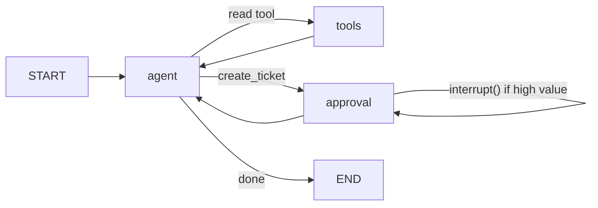

# Agentic Integration Service

**An LLM agent that takes action across enterprise systems - with the guardrails that make it trustworthy.**

This is API-led integration — the kind of work I did for years in MuleSoft — except now an
LLM decides *which* systems to call and *in what order*. The model plans; it isn't a hard-coded
flow. On top of that I added the controls an agent actually needs before a business will let it
touch production systems: **idempotency, retries with backoff, human-in-the-loop on risky
actions, and a full audit log of every decision and tool call.**

I've spent ~8 years building and operating integrations on MuleSoft and Azure, and the failure
modes here aren't theoretical — duplicate writes on retried deliveries, transient 5xx/429s from
downstream APIs, and "who approved this?" audit gaps are exactly the things that page you at 2am.
This project puts an agent in the orchestrator seat and keeps those controls in place.

---

## The workflow

When a support request arrives, the agent:

1. **Looks up the customer** in the CRM (tool #1, read).
2. **Enriches the company** via an external API to get firmographics + an estimated account value (tool #2, read).
3. **Decides a priority** based on that value.
4. **Creates a ticket** in the tracking system (tool #3, write) — **escalating to a human for approval when the account value is above a threshold.**

The LLM chooses each step via tool/function calling. Nothing about the sequence is hard-coded.



`agent` = the LLM. `tools` = safe reads. `approval` = the gated write that can pause for a human.

---

## The enterprise twist (the part that matters)

| Guardrail | How it's implemented | Where |
|---|---|---|
| **Idempotency** | `tickets` table has a `UNIQUE(idempotency_key)`; create uses `INSERT … ON CONFLICT DO NOTHING` and returns the original row. A retried or duplicated action can never create two tickets. The request's `external_id` is the key. | `app/services/tickets.py` |
| **Retries w/ backoff** | All external calls are wrapped with exponential backoff + jitter (tenacity). **Transient** faults (timeouts, 5xx, 429) retry; **permanent** ones (4xx) fail fast instead of hammering a broken endpoint. | `app/retry.py` |
| **Human-in-the-loop** | High-value ticket creation pauses the graph with LangGraph's `interrupt()` and waits for an explicit approve/reject before acting. The approval is a durable DB record, not just in-memory state. | `app/agent/graph.py`, `app/services/tickets.py` |
| **Audit log** | Every step — LLM decision, each tool call with inputs/outputs, approval requested/resolved, ticket created — is appended to an `audit_events` table and emitted as structured JSON logs. | `app/audit.py` |

A real run's audit trail (high-value account, approved) looks like this:

```
run_started
llm_decision
tool_call [lookup_customer] → tool_result [lookup_customer]
llm_decision
tool_call [enrich_company]  → tool_result [enrich_company]
llm_decision
approval_requested [create_ticket]
approval_resolved  [create_ticket]
tool_call [create_ticket]   → tool_result [create_ticket]
llm_final
run_completed
```

---

## Stack

- **Python** + **LangGraph** for the agent (explicit graph, so I control the HITL gate and audit hooks).
- **Azure OpenAI** as the model — this plays to my Azure background. Set `LLM_MODE=azure` + the `AZURE_OPENAI_*` vars.
- **FastAPI** exposes the agent as a service.
- **Postgres** is the ticket system of record (also holds the audit log and approval queue).
- **Docker / docker-compose** packages it.

It also ships a **deterministic `mock` LLM mode** (the default) that walks the same
lookup → enrich → create path with no credentials and no network. Being able to run and test the
whole agent offline is a genuine production asset — CI doesn't need a live model, and reviewers
can run it in one command.

---

## Run it

### Option A — Docker 

```bash
cp .env.example .env
docker compose up --build
# API on http://localhost:8000  (defaults to LLM_MODE=mock)
```

### Option B — local

```bash
python -m venv .venv && source .venv/bin/activate
pip install -r requirements.txt
# point DATABASE_URL at a Postgres, then:
uvicorn app.main:app --reload
```

### Try it

```bash
# Low-value account (globex.com) → auto-creates, no approval
curl -s localhost:8000/agent/runs -H 'content-type: application/json' -d '{
  "support_request": {"external_id":"sr-1001","customer_id":"C-2002",
                      "subject":"Login fails","message":"500 errors on login"}}'

# High-value account (acme.io) → returns status "awaiting_approval" + a run_id
curl -s localhost:8000/agent/runs -H 'content-type: application/json' -d '{
  "support_request": {"external_id":"sr-1002","customer_id":"C-1001",
                      "subject":"Outage","message":"Production is down"}}'

# Approve it (use the run_id from the previous response)
curl -s localhost:8000/agent/runs/<RUN_ID>/approve -H 'content-type: application/json' \
  -d '{"approved":true,"approver":"ops-lead@corp","note":"VIP, proceed"}'

# Inspect the full audit trail / the human queue
curl -s localhost:8000/agent/runs/<RUN_ID>/audit
curl -s localhost:8000/agent/approvals
```

Re-send either request with the **same `external_id`** and you'll get the **same ticket back** —
that's the idempotency guarantee.

### Demo data

| customer_id | domain | estimated value | path |
|---|---|---|---|
| `C-2002` | globex.com | 2,500 | auto-creates |
| `C-3003` | initech.co | 18,000 | needs approval |
| `C-1001` | acme.io | 50,000 | needs approval |

Threshold is `HIGH_VALUE_THRESHOLD` (default 10,000).

---

## API

| Method | Path | Purpose |
|---|---|---|
| POST | `/agent/runs` | Start a run from a support request |
| POST | `/agent/runs/{run_id}/approve` | Approve/reject a paused high-value action |
| GET | `/agent/runs/{run_id}/audit` | Full audit trail for a run |
| GET | `/agent/approvals` | Pending approvals (the human queue) |
| GET | `/tickets/{ticket_id}` | Fetch a ticket |
| GET | `/healthz`, `/readyz` | Liveness / readiness |

---

## Tests

```bash
pip install -r requirements.txt
pytest -q
```

- **Unit tests** (no DB, run anywhere): the approval threshold, the priority rule, and the
  transient-vs-permanent retry classification, including a flaky call that recovers on the 3rd attempt.
- **Integration tests** (full agent in mock mode, end-to-end through the FastAPI app): low-value
  auto-create, **idempotent re-submit creates no duplicate**, **high-value approve → ticket created**,
  **high-value reject → nothing created**, and the audit trail contents.

The integration tests need Postgres. They auto-skip if one isn't available, and auto-boot a
throwaway Postgres (`pgserver`) if it's installed, so `pytest` is green on a bare laptop too.

---

## Project structure

```
app/
  main.py            FastAPI app + endpoints
  config.py          settings (mock|azure, threshold, retry knobs)
  agent/
    graph.py         LangGraph: agent → tools|approval → agent; interrupt() for HITL
    tools.py         the 3 tools the LLM can call
    llm.py           Azure OpenAI provider + deterministic mock planner
    prompts.py       system prompt
  services/
    crm.py           tool #1 (mock dataset, HubSpot-ready)
    enrichment.py    tool #2 (mock, pluggable real API)
    tickets.py       tool #3 — idempotent create + approval records
  retry.py           exponential-backoff retry policy
  audit.py           append-only audit trail
  policy.py          pure, testable business rules
  models.py / db.py  SQLAlchemy async models + engine
tests/               unit + end-to-end integration
Dockerfile, docker-compose.yml, requirements.txt, .env.example
```
